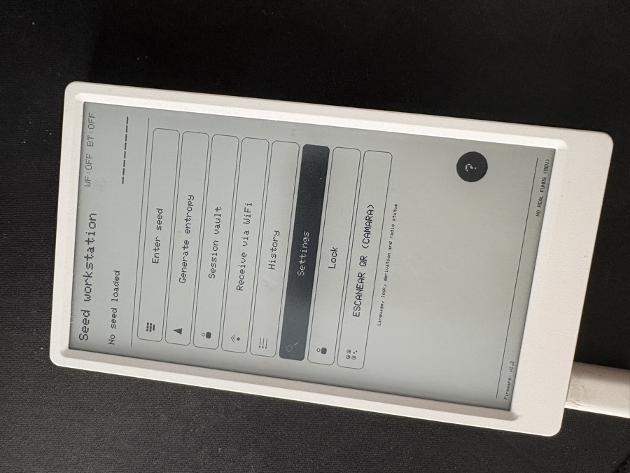

# M5Paper Seed Workstation

**v1.2**

An offline workstation for BIP39 seeds, Bitcoin key/address derivation and
**PSBT transaction signing**, running on the **M5Paper** (ESP32 with a 540×960
e-paper display and GT911 touch).

> **WARNING**: this is test data only. **DO NOT USE WITH REAL FUNDS** until a
> formal security review is completed.

> **Note**: this project was built with **Vibe Coding**, as an **experiment**.
> Do not use it with real funds.

Documentación en español: [`README_ES.md`](README_ES.md).

---

<p align="center">
  
  <br><em>Main menu of the device.</em>
</p>

## 1. What it does

- **Enter a BIP39 seed** (on-screen keyboard with autocomplete of the 2048 words).
- **Generate entropy** by drawing on screen or rolling dice.
- **Seed review & backup**: words, QR and **SEEDQR** (offline wizard).
- **Public key**: derive and display xpub/zpub (BIP32), with QR.
- **Address explorer**: derive P2PKH, P2SH and native segwit (BIP84) addresses,
  for receive and change, with a direct index jump.
- **BIP39 passphrase** (changes every derived address).
- **Individual vault**: one seed encrypted with its own password (`.vlt` file).
- **Session vault**: several seeds encrypted under one master password.
- **BLE key (M5Core2)**: physical cryptographic key that unlocks the session
  vault via BLE **challenge/response** + a 6-digit **PIN**. The key is paired
  over Bluetooth with ECDH (no typing); an existing password-only vault can be
  **migrated** to "password + key".
- **M5Stick provisioning (Pocket Signer)**: sends the active seed to an
  **M5Stick** over BLE, encrypted in transit with **ECIES** (ECDH + AES-256-GCM)
  and with physical confirmation on both devices. Full wire protocol in
  [`PROTOCOLO_M5STICK.md`](PROTOCOLO_M5STICK.md).
- **External camera QR scan (ESP32-CAM + OV2640)**: the M5Paper connects over BLE
  to a camera module that reads and decodes a QR and returns the already-decoded
  (opaque) payload. The content is delivered to the same pipeline as any QR
  (PSBT/UR/BBQr/descriptor). See [`PROTOCOLO_CAMARA_QR.md`](PROTOCOLO_CAMARA_QR.md).
  You can also use an **Android phone as camera** with the
  [**Android-M5Paper-QRCam**](https://github.com/MaCroTux/Android-M5Paper-QRCam) app.
- **Receive via WiFi** (access point + captive portal) or **USB serial**: PSBT
  (file or text) or BIP39 seed as text (the latter works with no seed in RAM).
- **SeedQR import**: recover a seed by scanning with the camera (or pasting via
  WiFi/serial) the same **SeedQR** the backup produces, plus plain-text seeds.
- **Sign PSBT** (ECDSA RFC6979 + BIP143) and broadcast:
  - **Single-sig** P2WPKH.
  - **Multisig** P2WSH `sortedmulti` (BIP48), 2-of-2 / 2-of-3 / 3-of-3, with
    Sparrow interop; signs with all available Vault seeds in one step.
  - **Sparrow**: static QR (hex of the signed transaction).
  - **BlueWallet**: animated **BBQr** QR (single-sig only).
- **Transaction history**: every received PSBT is saved to SD and can be
  reviewed and re-signed later.
- **Settings** stored on SD: language (English by default / Spanish), auto-lock
  timeout (1/3/5/10 min or never), seed-wipe timeout (never/10/30/60 min),
  default derivation (BIP44/49/84) and radio status (BT/WiFi/power).
- **Lock** (manual or on inactivity) with a **static cover screen** (no animations,
  to save e-ink battery) that doubles as an off/screensaver screen.

---

## 2. Main menu

```
ENTER SEED            (type a BIP39 seed)
GENERATE ENTROPY      (draw or roll dice)
SESSION VAULT         (create/open a multi-seed vault)
RECEIVE VIA WIFI      (AP to receive a PSBT or seed from your phone)
HISTORY               (saved transactions to review or sign again)
SETTINGS              (language, lock, derivation, radio)
LOCK                  (lock the device with the cover screen)
```

**Help** is available through the `?` icon in the bottom-right corner of the main
menu (secondary option).

When a seed is active, the first entry becomes **ACTIVE SEED** and
"GENERATE ENTROPY" is disabled.

---

## 3. Signing flow (PSBT)

```
PSBT (WiFi or serial)
   ↓
M5Paper decodes and shows the transaction
   (PAYMENT / CHANGE / FEE + addresses in a box)
   ↓
[ DETAILS ] → list of UTXOs (inputs)
   ↓
[ SIGN ]    → signs each input (segwit P2WPKH)
   ↓
[ BROADCAST ] → SPARROW (static hex QR)  |  BLUEWALLET (BBQr QR)
   ↓
External wallet recognizes and broadcasts the transaction
```

Verified end-to-end: BlueWallet reads the signed transaction and the result
matches Coinb.in.

---

## 4. Receiving a PSBT / seed

### Via WiFi

1. **RECEIVE VIA WIFI** (main menu or active-seed menu).
2. Choose the input mode:
   - **UPLOAD FILE (PSBT)**: upload a `.psbt` file (requires a loaded seed).
   - **PASTE TRANSACTION (PSBT)**: paste the PSBT as text (base64, hex or UR) (requires a loaded seed).
   - **PASTE BIP39 SEED**: import a 12/24-word seed (no prior seed required).
3. The M5Paper creates an AP `M5Paper-QR` (random key) with a **connection QR**
   and a **captive portal** adapted to the chosen mode.
4. Scan the QR with your phone, connect, and the web page opens automatically.
5. Upload/paste the content. The AP turns off automatically once received.

### Via serial (development)

```bash
python3 PSBTSerialSend.py transaction.psbt
```

Protocol: `M5PSBT <len> <sha256>\n` + binary payload + `\nM5END\n`.
The M5Paper replies `READY` and verifies the SHA256 before processing.

It also accepts `incommit-transaction: <base64>` as a text command.

### Console protocol (line-based)

The desktop console (`m5paper_console.py`) can drive the device over serial with
ASCII line commands (each ends in `\n`):

| Command | Response |
|---|---|
| `M5PING` | `M5OK version=<ver>` |
| `M5TIME <unix>` | `M5OK time=<unix>` (sets RTC) |
| `M5VAULT LIST` | `M5VAULTS N` + `VLT/SVM\t<file>\t<label>` … `M5END` |
| `M5VAULT SEEDS <name>` | `M5SEEDS N` + `<fpr>\t<label>` … `M5END` |
| `M5VAULT OPEN <name>` | `READY` (then wait for `M5PASS`) |
| `M5PASS <password>` | `M5OK vault=… [fingerprint=… words=… | seeds=…]` |
| `M5SEED <words>` | `M5OK fingerprint=<fpr> words=<n>` |
| `M5TX LIST` | `M5TXS N` + `PSBT\t<file>` … `M5END` |
| `M5TX LOAD <name>` | `M5OK tx=… inputs=… outputs=… [fee/pago/cambio/multisig]` |
| `M5TX SIGN` | `M5OK signed=tx hex=…` / `M5OK signed=partial …` |
| `M5STATE` | `M5OK fingerprint=… words=… tx=…` |

Errors are reported as `M5ERR <code>` (`no_sd`, `io_error`, `wrong_password`,
`locked`, `invalid_seed`, `invalid`, `not_found`, `bad_cmd`).

**Security invariant**: the seed (words/indices) and private key are **never**
sent over serial. Only the fingerprint (4 bytes), signatures, signed transactions,
summaries and clear SD metadata leave the device.

---

## 5. File layout

| File | Role |
|---|---|
| `NativeApp.cpp` | Main UI (M5EPD): screens, navigation, state machine. |
| `M5PaperSeedWorkstation.ino` | Sketch entry point (the UI lives in `NativeApp.cpp`). |
| `bip39_support.hpp` | BIP39 list, prefix search, checksum, `from_entropy`, self-tests. |
| `bitcoin_hd.hpp` | BIP32: BIP39→seed, hardened/normal derivation, xpub/zpub, base58check. |
| `bitcoin_address.hpp` | P2PKH/P2SH/native segwit/taproot addresses (bech32, bech32m). |
| `bitcoin_fingerprint.hpp` | Master key fingerprint. |
| `ripemd160_min.hpp` | RIPEMD-160. |
| `encrypted_seed_store.hpp` | Individual vault: AES-256-GCM + PBKDF2. |
| `session_vault_store.hpp` | Session vault: master key + seeds. |
| `ble_key.hpp` | Shared BLE-key crypto (HMAC-SHA256, ECDH secp256k1, NVS persistence). |
| `ble_key_client.hpp/.cpp` | BLE client (M5Paper): scan → challenge → verify HMAC + pairing. |
| `ble_key_server.hpp/.cpp` | BLE GATT server (M5Core2): challenge/response + pairing (ALLOW/DENY). |
| `vault_key.hpp` | Core2+PIN second unlock factor: wraps the session master key (`.k2f`). |
| `ble_provision.hpp` | M5Paper→M5Stick provisioning protocol: payload + ECIES (tag `m5-stick-provision-v1`). |
| `ble_provision_client.hpp/.cpp` | BLE client (M5Paper) that encrypts and sends the seed to the M5Stick. |
| `qr_cam_client.hpp/.cpp` | BLE client for the ESP32-CAM module (receives decoded QR over BLE). |
| `psbt_parser.hpp` | PSBT parser (BIP174) + transactions, binary/base64/hex/UR detection. |
| `ur_psbt.hpp` | `UR:CRYPTO-PSBT` decoding (bytewords + CBOR). |
| `tx_sign.hpp` | Segwit signing: RFC6979, BIP143 sighash, finalization & serialization. |
| `bbqr.hpp` | BBQr encoding (BIP-129 / Coinkite): `B$HPxxxx` header + hex. |
| `seedqr_qrcode.c/.h` | QR generation (MIT license). |
| `generated/bip39_english.h` | The 2048 words in PROGMEM. |
| `qr_wifi_server.hpp` | WiFi access point + HTTP server + captive portal. |
| `qr_ble_client.hpp/.cpp` | BLE client (NimBLE) — **hidden in the menu, not removed**. |
| `lang.hpp` | EN/ES translation (`lang::tr`) with a Spanish→English table. |
| `device_settings.hpp` | SD-persisted settings (`/m5settings.cfg`): language, lock, derivation. |
| `AUDITORIA.md` | Security & UX audit (Spanish). |
| `TECHNICAL.md` | Detailed technical documentation. |
| `PROTOCOLO_M5STICK.md` | Wire specification for M5Paper→M5Stick BLE provisioning (Spanish). |
| `PROTOCOLO_CAMARA_QR.md` | Wire specification for ESP32-CAM BLE QR scanning (Spanish). |
| `DEBUG_FIRMA.md` | Post-mortem of the P2WPKH signing bug (Spanish). |

---

## 6. Building

### PlatformIO (compile validation)

```bash
~/.platformio/penv/bin/pio run -e native
```

The `native` environment uses `espressif32@5.0.0` (arduino-esp32 core **2.0.3**),
board `m5stack-fire`, `M5EPD` from `~/Documents/Arduino/libraries/M5EPD` and
`NimBLE-Arduino@^1.4.0`.

### Arduino IDE (real build / flashing)

- Board: **M5Stack-FIRE**, core **esp32 2.0.3**.
- Libraries in `~/Documents/Arduino/libraries`: `M5EPD`, `NimBLE-Arduino` (v1.4.x).

Reliable flashing over marginal USB: `esptool.py --no-stub --baud 115200 write_flash 0x10000 firmware.bin`.

### Unit tests (host, no hardware)

The crypto/parsing/vault logic lives in `lib/seedworkstation_core` and is covered
by host unit tests (PlatformIO `native` + Unity):

```bash
~/.platformio/penv/bin/pio test -e host
```

Requires mbedtls on the host (`brew install mbedtls@2` on macOS,
`apt-get install libmbedtls-dev` on Debian/Ubuntu). Test mocks (`Arduino.h`,
`SD.h`, `Preferences.h`, `mbedtls_compat.h`) live in `test/mocks/`; each module
has its own test suite under `test/<module>/`. CI runs the same command on every
push/PR.

---

## 7. Security design

- **Encryption at rest**: AES-256-GCM with the full header as AAD; detects
  tampering of salt, nonce and metadata.
- **Key derivation**: PBKDF2-HMAC-SHA256 with **600,000 iterations** and a random
  16-byte salt per file (hardware RNG `esp_fill_random`).
- **BLE key (Core2 + PIN)**: the M5Core2 holds the **private key `sk`**, encrypted at
  rest under `PBKDF2(PIN)` (the PIN is entered on the Core2 itself; 3 wrong PINs wipe
  `sk`). The M5Paper wraps the session master key with the Core2's **public key**
  (ECIES over secp256k1), so it cannot decrypt without the Core2. The password path
  always remains available as recovery.
- **Signing**: ECDSA secp256k1 with **deterministic nonce RFC6979** + **low-S**;
  **BIP143** sighash (segwit v0). BIP32 path verified via master fingerprint.
- **Memory wiping**: `wipe()` (volatile) over keys, plaintext, seed buffers, etc.
- **Auto-lock** on inactivity (configurable) plus manual lock.
- **Boot self-tests**: BIP39, BIP32, fingerprint, PBKDF2 (against
  `mbedtls_pkcs5_pbkdf2_hmac`), ECDSA (RFC6979), PSBT parser, BIP84 addresses.

---

## 8. Bluetooth (hidden, not removed)

BLE client (`qr_ble_client.hpp/.cpp`) to receive a QR from a Raspberry Pi
(`M5Paper-QR` GATT server), **disabled** in the menu. Bluedroid was replaced with
**NimBLE** because Bluedroid produced internal `configASSERT` on the M5Paper.

---

## 9. BLE key (M5Core2): password + key

A **M5Core2** acts as the physical key that decrypts the **session vault**
(`.svm`). The Core2 holds a private key `sk` (PIN-protected); the M5Paper stores
the vault master key encrypted with the Core2's public key. Stealing the M5Paper
alone reveals nothing.

### Pairing (once)

1. Core2: menu → `LLAVE BLE` (generates `sk` the first time, stays `LOCKED`).
2. M5Paper: `AJUSTES → BLE KEY → EMPAREJAR M5CORE2`.
3. The Core2 shows `PAIR REQUEST` → press `AUTHORIZE`.
4. The M5Paper reads the Core2's **public key** `pk` and stores it (it is public).

### Enabling / migrating a vault

- New vault: unlock by password → `ACTIVAR CORE2+PIN` (session menu).
- Existing password-only vault: `AJUSTES → BLE KEY → MIGRAR A PASS+LLAVE` →
  select the `.svm` → enter its password.
- Then the **Core2** asks you to **set a 6-digit PIN** (entered on the Core2,
  twice). The M5Paper wraps the master key with `pk` (ECIES) into a `.k2f` file.
  The password path stays available as recovery.

### Unlocking

`VAULT DE SESION → DESBLOQUEAR CON CORE2` → the M5Paper sends the wrapped master
to the Core2 → the Core2 asks for the **PIN** (on its own screen) → decrypts and
returns the master key **encrypted with a per-session ECIES key** (never in
clear). 3 wrong PINs on the Core2 wipe its key. The Core2 only sees the master
key transiently in RAM, never the seeds.

---

## 10. M5Stick provisioning (BLE)

The M5Paper can **provision** (send) the active seed to an **M5Stick Pocket
Signer** over BLE. The M5Stick acts as the server (peripheral) in `IMPORT SEED`
mode; the M5Paper is the client (central) that scans, connects and sends.

### Flow

1. On the M5Paper, with an active seed: `ACTIVE SEED → BACKUP SEED →
   PROVISIONAR M5STICK`.
2. A security warning is shown (`I AM IN A SAFE PLACE`); on confirmation the
   M5Paper scans for the M5Stick.
3. The M5Paper reads the M5Stick's **public key** and encrypts the seed
   (`count ‖ word_idx ‖ fingerprint`) with **ECIES** (ECDH secp256k1 +
   AES-256-GCM). The seed is **never** sent in clear.
4. The M5Stick decrypts it, shows `IMPORT SEED? FPR …` and the user confirms
   physically (`HOLD CENTER`). The M5Stick notifies `accepted`/`denied`/`error`.
5. The M5Paper shows `PROVISIONADO` (or `RECHAZADO`/failure with retry).

Confirmation is physical on **both** devices. UUIDs, payload and status codes in
[`PROTOCOLO_M5STICK.md`](PROTOCOLO_M5STICK.md).

---

## 11. External camera QR scan (BLE)

The M5Paper can use an **ESP32-CAM + OV2640** as a vision coprocessor. The camera
reads a QR, decodes it and sends the **already-decoded** (opaque) payload over BLE;
the M5Paper receives no images.

### Flow

1. `RECEIVE → SCAN QR (CAMERA)`.
2. The M5Paper scans for `M5Paper-QR-CAM`, connects and subscribes to `TX`
   (NOTIFY); it sends `STATUS` over `RX` (WRITE).
3. Show the QR to the camera. `QRBEGIN:<size>:<chunks>` arrives, then
   `<index>:<data>` fragments and `QREND`.
4. The M5Paper reassembles (by index), verifies the size and delivers the payload
   to the same pipeline as any QR: if it is a **PSBT**, it is saved and the
   transaction review opens; otherwise the decoded content is shown.

Limits (`MAX_QR_PAYLOAD` 32 KB, `MAX_QR_CHUNKS` 1024) and a 30 s timeout. The camera
is **untrusted**: it never receives a seed or keys, and everything received is
validated like any QR. Details in [`PROTOCOLO_CAMARA_QR.md`](PROTOCOLO_CAMARA_QR.md).

### No-camera alternative: Android app

If you don't want to build an ESP32-CAM module or use WiFi, you can use your
**Android phone as camera**: the
[**Android-M5Paper-QRCam**](https://github.com/MaCroTux/Android-M5Paper-QRCam) app
acts as `M5Paper-QR-CAM` and sends the already-decoded QR over BLE (same protocol
as this section). It's the practical solution for users who prefer not to use WiFi.

---

## 12. Status / backlog

- [x] WiFi AP reception (captive portal + connection QR) with 3 modes.
- [x] USB serial reception (`M5PSBT` protocol + SHA256).
- [x] `UR:CRYPTO-PSBT` decoding (Sparrow QR).
- [x] PSBT signing (single-sig P2WPKH + multisig P2WSH sortedmulti) + QR (Sparrow/BlueWallet).
- [x] SD-persisted settings (language, lock, derivation, radio).
- [x] Transaction history (save and re-sign received PSBTs).
- [x] Full EN/ES translation.
- [x] BLE key (M5Core2) + PIN as a second unlock method for the session vault.
- [x] BLE provisioning of the seed to the M5Stick (client with ECIES in transit).
- [x] External ESP32-CAM QR scan (BLE client + fragmented reassembly).
- [ ] Base32 and zlib in BBQr (future optimization).
- [ ] Server side of provisioning on the M5Stick (M5Stick firmware, separate project).
- [ ] ESP32-CAM firmware (server side of the camera protocol, separate project).

---

## 13. Usage warning

This firmware handles private keys. Do not use with real funds until a formal
security review and exhaustive physical testing are completed.
